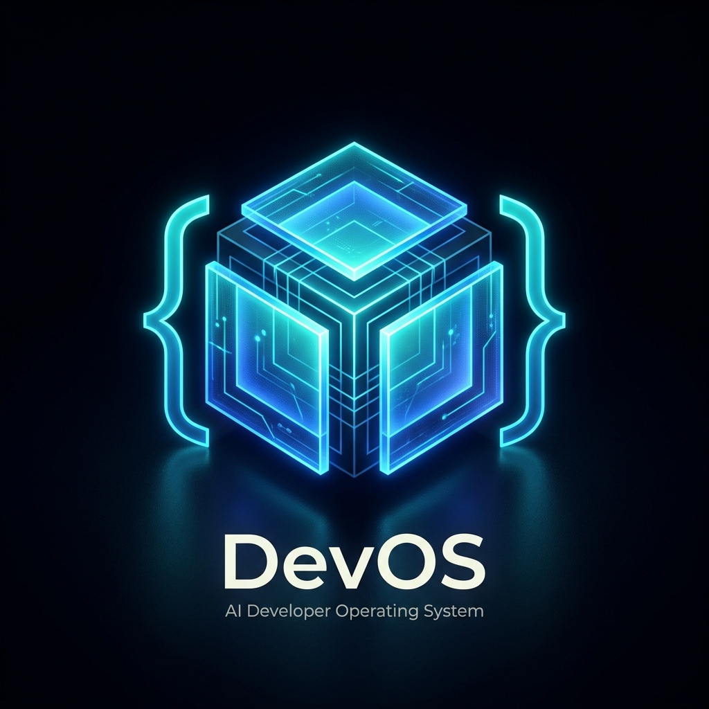
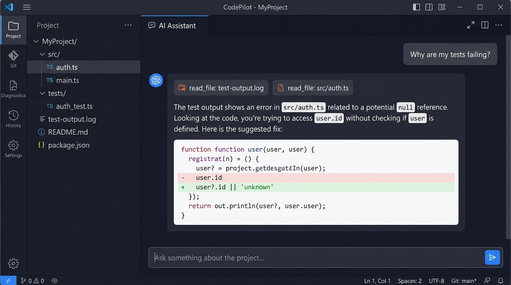
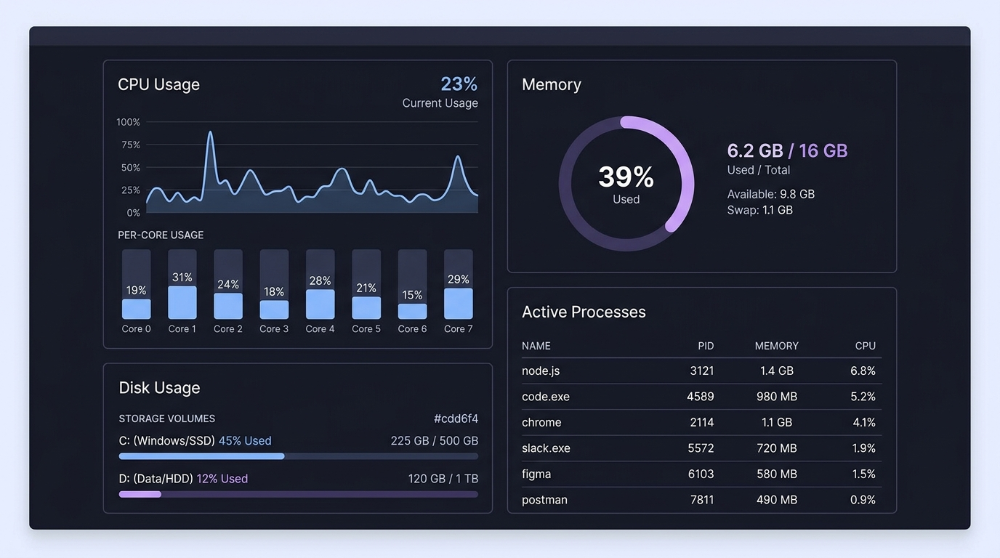
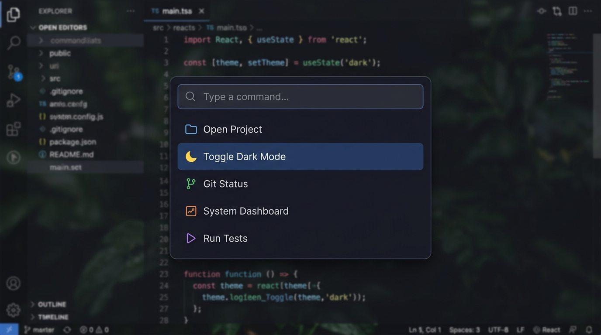

<div align="center">



# DevOS

**A local-first AI developer OS that actually does things.**

It reads your code. It runs your tests. It finds bugs and fixes them.  
Everything stays on your machine.

[](https://www.typescriptlang.org/)
[](https://react.dev/)
[](LICENSE)

</div>

---

## Screenshots

<div align="center">

### AI Chat — Ask anything about your codebase


<br/><br/>

### System Diagnostics — CPU, memory, disk, processes at a glance


<br/><br/>

### Command Palette — Quick access to everything (Ctrl+K)


</div>

---

## Why?

Most "AI coding tools" are glorified autocomplete or chat wrappers that can't actually touch your project. You copy-paste code in, get a response, copy-paste it back.

DevOS is different. It's a real tool that connects to your filesystem, your Git repo, your terminal, and your runtime. When you ask "why are my tests failing?", it doesn't guess — it reads your test output, finds the failing file, reads the source, identifies the bug, and proposes a fix. Then it asks for your OK before touching anything.

No cloud. No lock-in. No magic. Just tools.

---

## What can it do?

**Ask it something →** it figures out which tools to use → runs them → shows you the result.

```
You:    "Why are my tests failing?"

DevOS:  → read_file test-output.log
        → read_file src/auth/validate.ts
        
        Found it. Line 47 accesses `user.id` but `user` can be null
        when the session expires. Here's the fix:
        
        -  const id = user.id
        +  const id = user?.id ?? 'anonymous'
        
        Want me to apply it? [Approve] [Reject]
```

It uses a [ReAct loop](https://arxiv.org/abs/2210.03629) — think, act, observe, repeat — until it solves the problem or runs out of steps.

### Tools it has access to

| Tool | What it does | Needs approval? |
|---|---|---|
| `read_file` | Read any project file | No |
| `write_file` | Edit code | Yes |
| `list_directory` | Browse folders | No |
| `search_files` | Find files by name | No |
| `search_code` | Grep with regex | No |
| `run_command` | Shell commands | Yes |
| `run_tests` | Run test suite | Yes |

Plus: Git status/diff/log, system diagnostics (CPU/RAM/disk/processes/network), project auto-detection.

---

## Get started

```bash
git clone https://github.com/mnvvshu/DevOS.git
cd DevOS
pnpm install
cp .env.example .env    # then add your API key
pnpm dev                # open http://localhost:5173
```

### Pick an AI provider

Edit `.env`:

```env
# OpenAI
AI_PROVIDER=openai
OPENAI_API_KEY=sk-...

# Anthropic
AI_PROVIDER=anthropic
ANTHROPIC_API_KEY=sk-ant-...

# Ollama (free, no key needed)
AI_PROVIDER=ollama
OLLAMA_BASE_URL=http://localhost:11434
OLLAMA_MODEL=llama3.1
```

Don't want to pay? [Install Ollama](https://ollama.com), pull a model, done.

---

## How it's built

This isn't a weekend project. It's a properly engineered TypeScript monorepo with 13 packages.

```
DevOS/
├── apps/
│   ├── web/                → React 19 + Vite + Tailwind
│   └── desktop/            → Electron (hardened)
│
├── packages/
│   ├── agent/              → ReAct loop, conversation management
│   ├── ai-providers/       → OpenAI / Anthropic / Ollama (raw fetch, no SDKs)
│   ├── database/           → JSON file storage, zero native deps
│   ├── git-ops/            → status, diff, log, branches via execFile
│   ├── logger/             → Structured JSON logging + EventBus
│   ├── permissions/        → 3-tier approval system
│   ├── repo-intel/         → auto-detect language, framework, test runner
│   ├── server/             → Fastify REST + WebSocket
│   ├── shared/             → Types, utils, Zod schemas
│   ├── system/             → CPU, RAM, disk, processes, network
│   └── tools/              → 7 tools with validation + timeouts
│
├── tests/
│   ├── unit/               → permissions, utils, detection
│   └── security/           → injection, traversal, prompt attacks
│
└── docs/                   → ARCHITECTURE, SECURITY, API, CONTRIBUTING
```

### Stack choices

| Choice | Reason |
|---|---|
| Raw `fetch()` for AI calls | No SDK lock-in, full control over SSE streaming |
| `execFile` not `exec` | Prevents shell injection by design |
| JSON file storage | No C++ compiler needed, works everywhere |
| pnpm + Turborepo | Fast installs, dependency-aware cached builds |
| Zod schemas | Runtime validation at every boundary |

---

## Security

Every destructive action goes through a 3-tier permission gate:

| | What happens |
|---|---|
| **Safe** | Read file, search code, git log → just runs |
| **Approval required** | Write file, run command → asks you first |
| **Blocked** | `rm -rf`, credential access, privilege escalation → denied, always |

Other stuff:
- Paths are resolved and checked against the project root (no `../../etc/passwd`)
- `.env`, SSH keys, and secrets are never readable
- All shell commands go through `execFile` (no shell interpolation)
- Repository contents are treated as untrusted (prompt injection defense)
- Everything is logged to an audit trail

Full details in [SECURITY.md](docs/SECURITY.md).

---

## Commands

```bash
pnpm dev           # start frontend + backend
pnpm build         # compile everything (13 packages)
pnpm test          # run unit + security tests
pnpm typecheck     # strict TypeScript check
pnpm lint          # ESLint
```

---

## What's next

- [ ] Electron packaging with auto-updates
- [ ] Bundled ripgrep for faster search
- [ ] Tree-sitter for AST-aware context
- [ ] Terminal emulator in the UI
- [ ] Multi-file diff viewer
- [ ] Agent memory across sessions
- [ ] Custom tool plugins
- [ ] MCP protocol support

---

## Contributing

PRs welcome. Read [CONTRIBUTING.md](docs/CONTRIBUTING.md) first.

## License

MIT

---

<div align="center">

Built by [mnvvshu](https://github.com/mnvvshu)

</div>
